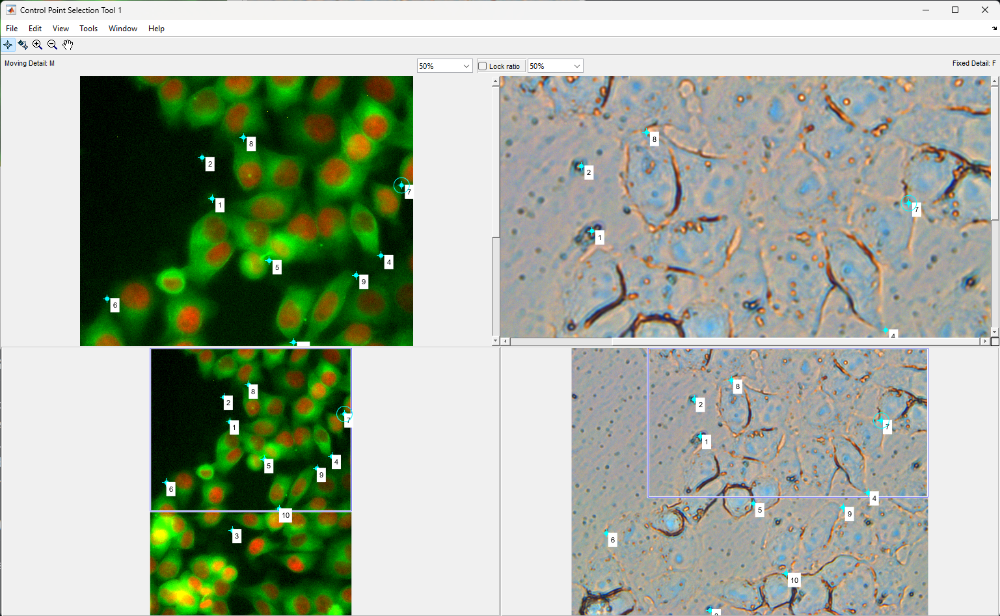

# Unsupervised Microscopy image registration

## Unaligned datset preprocessing for training

1. Data should be partitioned partition_paired_dataset. This will split the data  into train and test (80-20%  of the images).
2. With matlab scale_annotated.m script to generate warped images that will be on the same scale as the fixed images.
3. create_unaligned_datapairs.py will center crop the warped and the fixed images. 
4. The generated images can be forwared to Contrastive Unparied training.

## Aligned datset preprocessing for training

For evaluation and Supervised training 
1. Data should be partitioned partition_paired_dataset. If it is done before not necesarry to repeat.
2. With matlab align_annotated.m script to generate warped images.
3. align_annotated_script will center crop the warped and the fixed images and remove black parts coming from warping. 
4. The generated images can be forwared to U-Net training.
See /U-Net

## Annotation

Use code from matlab_scripts/imreg_annotation.m
There will be simple image reading procedures,
example of loading imagepairs into CPselect tool,
example of saving the landmark annotations,
visualization codes to ovelay the aligned images for validation
  
Example landmark annotation:
 

  

 

## Inference and Evaluation

/ContrastiveUnpariedTranslation folder Cut_{dataset} jupyter notebook training scripts contains test examples.
The output folders of the test script should be added to SuperPoint/superpoint/calc_sp_sift_corr_{dataset}.py
This script will try to align images, outputs result transformation into SuperPoint/superpoint/result/{experiment}
The output of the scale_annotated.m mat files are containing the ground truth transformations in 2x3 format
eval_all_data.py will read result and ground truth transformations and compare them.

## Inference with SuperCUT

Registrationpipelineinference folder contains the SuperCUT packaged into a single repository.
Images can be forwarded with CLI to the pipeline which will return with a transformation matrix.
(see readme in the folder)

## Models

https://zenodo.org/records/10108327

## Citation

{placeholder}

This repository is based on these methods:

@inproceedings{park2020cut,
  title={Contrastive Learning for Unpaired Image-to-Image Translation},
  author={Taesung Park and Alexei A. Efros and Richard Zhang and Jun-Yan Zhu},
  booktitle={European Conference on Computer Vision},
  year={2020}
}

@inproceedings{detone2018superpoint,
  title={Superpoint: Self-supervised interest point detection and description},
  author={DeTone, Daniel and Malisiewicz, Tomasz and Rabinovich, Andrew},
  booktitle={Proceedings of the IEEE Conference on Computer Vision and Pattern Recognition Workshops},
  pages={224--236},
  year={2018}
}
